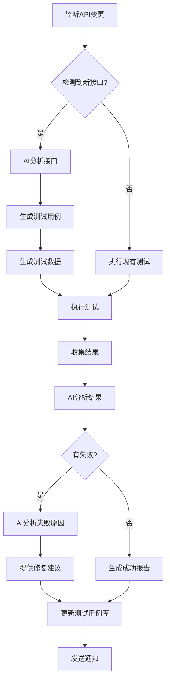

# Vue-FastAPI-Admin 测试方案

## 一、测试概述

### 1.1 项目背景
本项目是基于 FastAPI + Vue3 的前后端分离管理平台，具备 RBAC 权限管理、动态路由和 JWT 鉴权功能。

### 1.2 测试目标
- 覆盖所有后端 API 接口（目标覆盖率 80%+）
- 实现前后端集成测试
- 建立 AI 智能化测试框架，支持自动化用例生成和执行
- 基于 API 列表自动生成和更新测试用例

### 1.3 测试环境
- **后端**: Python 3.11 + FastAPI + Tortoise ORM
- **前端**: Vue3 + Vite + Naive UI
- **数据库**: SQLite/PostgreSQL/MySQL
- **测试框架**: 
  - 后端: pytest + httpx + pytest-asyncio
  - 前端: Vitest + Vue Test Utils
  - E2E: Playwright
  - AI测试: LangChain + OpenAI API

---

## 二、测试架构设计

### 2.1 测试层级

```
┌─────────────────────────────────────┐
│     E2E 端到端测试 (Playwright)      │
├─────────────────────────────────────┤
│     集成测试 (API + Database)        │
├─────────────────────────────────────┤
│     单元测试 (Controllers/Utils)     │
├─────────────────────────────────────┤
│     AI智能测试生成器                 │
└─────────────────────────────────────┘
```

### 2.2 目录结构

```
tests/
├── unit/                    # 单元测试
│   ├── test_controllers/
│   ├── test_utils/
│   └── test_models/
├── integration/             # 集成测试
│   ├── test_api_v1/
│   │   ├── test_users.py
│   │   ├── test_roles.py
│   │   ├── test_menus.py
│   │   ├── test_apis.py
│   │   ├── test_depts.py
│   │   ├── test_base.py
│   │   ├── test_auditlog.py
│   │   ├── test_wechat.py
│   │   ├── test_wxapp.py
│   │   └── test_crawler.py
│   └── conftest.py
├── e2e/                     # 端到端测试
│   ├── test_login_flow.py
│   ├── test_user_management.py
│   └── test_permission_flow.py
├── ai_testing/              # AI 智能测试
│   ├── test_generator.py   # 测试用例生成器
│   ├── api_analyzer.py      # API 分析器
│   ├── test_executor.py     # 测试执行器
│   └── report_generator.py  # 报告生成器
├── fixtures/                # 测试数据
│   ├── users.json
│   ├── roles.json
│   └── menus.json
├── conftest.py              # 全局配置
├── pytest.ini               # pytest 配置
└── requirements-test.txt    # 测试依赖
```

---

## 三、功能测试用例清单

### 3.1 认证与授权模块 (Base)

#### 3.1.1 登录认证
| 用例ID | 用例名称 | 接口路径 | 测试场景 | 优先级 |
|--------|---------|---------|---------|--------|
| AUTH-001 | 正常登录 | POST /api/v1/base/access_token | 使用正确的用户名密码登录 | P0 |
| AUTH-002 | 错误密码 | POST /api/v1/base/access_token | 使用错误密码登录 | P0 |
| AUTH-003 | 不存在用户 | POST /api/v1/base/access_token | 使用不存在的用户名 | P0 |
| AUTH-004 | 空用户名 | POST /api/v1/base/access_token | 用户名为空 | P1 |
| AUTH-005 | 空密码 | POST /api/v1/base/access_token | 密码为空 | P1 |
| AUTH-006 | SQL注入防护 | POST /api/v1/base/access_token | 输入SQL注入语句 | P0 |

#### 3.1.2 用户信息
| 用例ID | 用例名称 | 接口路径 | 测试场景 | 优先级 |
|--------|---------|---------|---------|--------|
| USER-INFO-001 | 获取当前用户信息 | GET /api/v1/base/userinfo | 有效Token获取用户信息 | P0 |
| USER-INFO-002 | 无Token访问 | GET /api/v1/base/userinfo | 不带Token访问 | P0 |
| USER-INFO-003 | 过期Token | GET /api/v1/base/userinfo | 使用过期Token | P0 |
| USER-INFO-004 | 非法Token | GET /api/v1/base/userinfo | 使用伪造Token | P0 |

#### 3.1.3 用户菜单
| 用例ID | 用例名称 | 接口路径 | 测试场景 | 优先级 |
|--------|---------|---------|---------|--------|
| MENU-001 | 超级管理员菜单 | GET /api/v1/base/usermenu | 超级管理员获取所有菜单 | P0 |
| MENU-002 | 普通用户菜单 | GET /api/v1/base/usermenu | 普通用户获取授权菜单 | P0 |
| MENU-003 | 无权限用户菜单 | GET /api/v1/base/usermenu | 无任何角色用户 | P1 |

#### 3.1.4 用户API权限
| 用例ID | 用例名称 | 接口路径 | 测试场景 | 优先级 |
|--------|---------|---------|---------|--------|
| API-PERM-001 | 超级管理员API | GET /api/v1/base/userapi | 超级管理员获取所有API | P0 |
| API-PERM-002 | 普通用户API | GET /api/v1/base/userapi | 普通用户获取授权API | P0 |

#### 3.1.5 修改密码
| 用例ID | 用例名称 | 接口路径 | 测试场景 | 优先级 |
|--------|---------|---------|---------|--------|
| PWD-001 | 正常修改密码 | POST /api/v1/base/update_password | 旧密码正确，修改密码 | P0 |
| PWD-002 | 旧密码错误 | POST /api/v1/base/update_password | 旧密码输入错误 | P0 |
| PWD-003 | 弱密码验证 | POST /api/v1/base/update_password | 新密码过于简单 | P1 |

---

### 3.2 用户管理模块 (Users)

| 用例ID | 用例名称 | 接口路径 | 测试场景 | 优先级 |
|--------|---------|---------|---------|--------|
| USER-001 | 用户列表分页 | GET /api/v1/user/list | 正常分页查询 | P0 |
| USER-002 | 用户搜索-用户名 | GET /api/v1/user/list | 按用户名搜索 | P0 |
| USER-003 | 用户搜索-邮箱 | GET /api/v1/user/list | 按邮箱搜索 | P1 |
| USER-004 | 用户搜索-部门 | GET /api/v1/user/list | 按部门ID筛选 | P1 |
| USER-005 | 查看用户详情 | GET /api/v1/user/get | 根据ID查询用户 | P0 |
| USER-006 | 查看不存在用户 | GET /api/v1/user/get | 查询不存在的用户ID | P1 |
| USER-007 | 创建用户-正常 | POST /api/v1/user/create | 完整信息创建用户 | P0 |
| USER-008 | 创建用户-邮箱重复 | POST /api/v1/user/create | 使用已存在邮箱 | P0 |
| USER-009 | 创建用户-必填项缺失 | POST /api/v1/user/create | 缺少必填字段 | P1 |
| USER-010 | 创建用户-邮箱格式错误 | POST /api/v1/user/create | 邮箱格式不正确 | P1 |
| USER-011 | 更新用户信息 | POST /api/v1/user/update | 修改用户信息 | P0 |
| USER-012 | 更新用户角色 | POST /api/v1/user/update | 修改用户角色 | P0 |
| USER-013 | 删除用户 | DELETE /api/v1/user/delete | 删除指定用户 | P0 |
| USER-014 | 删除不存在用户 | DELETE /api/v1/user/delete | 删除不存在的用户 | P1 |
| USER-015 | 重置用户密码 | POST /api/v1/user/reset_password | 管理员重置密码 | P0 |

---

### 3.3 角色管理模块 (Roles)

| 用例ID | 用例名称 | 接口路径 | 测试场景 | 优先级 |
|--------|---------|---------|---------|--------|
| ROLE-001 | 角色列表分页 | GET /api/v1/role/list | 正常分页查询 | P0 |
| ROLE-002 | 角色搜索 | GET /api/v1/role/list | 按角色名称搜索 | P0 |
| ROLE-003 | 查看角色详情 | GET /api/v1/role/get | 根据ID查询角色 | P0 |
| ROLE-004 | 创建角色-正常 | POST /api/v1/role/create | 完整信息创建角色 | P0 |
| ROLE-005 | 创建角色-名称重复 | POST /api/v1/role/create | 使用已存在角色名 | P0 |
| ROLE-006 | 创建角色-必填项缺失 | POST /api/v1/role/create | 缺少必填字段 | P1 |
| ROLE-007 | 更新角色信息 | POST /api/v1/role/update | 修改角色信息 | P0 |
| ROLE-008 | 删除角色 | DELETE /api/v1/role/delete | 删除指定角色 | P0 |
| ROLE-009 | 查看角色权限 | GET /api/v1/role/authorized | 查询角色的菜单和API权限 | P0 |
| ROLE-010 | 更新角色权限-菜单 | POST /api/v1/role/authorized | 修改角色菜单权限 | P0 |
| ROLE-011 | 更新角色权限-API | POST /api/v1/role/authorized | 修改角色API权限 | P0 |

---

### 3.4 菜单管理模块 (Menus)

| 用例ID | 用例名称 | 接口路径 | 测试场景 | 优先级 |
|--------|---------|---------|---------|--------|
| MENU-M-001 | 菜单树形列表 | GET /api/v1/menu/list | 获取树形结构菜单 | P0 |
| MENU-M-002 | 查看菜单详情 | GET /api/v1/menu/get | 根据ID查询菜单 | P0 |
| MENU-M-003 | 创建顶级菜单 | POST /api/v1/menu/create | 创建parent_id=0的菜单 | P0 |
| MENU-M-004 | 创建子菜单 | POST /api/v1/menu/create | 创建子级菜单 | P0 |
| MENU-M-005 | 创建菜单-必填项缺失 | POST /api/v1/menu/create | 缺少必填字段 | P1 |
| MENU-M-006 | 更新菜单信息 | POST /api/v1/menu/update | 修改菜单信息 | P0 |
| MENU-M-007 | 删除叶子菜单 | DELETE /api/v1/menu/delete | 删除无子菜单的菜单 | P0 |
| MENU-M-008 | 删除有子菜单 | DELETE /api/v1/menu/delete | 删除有子菜单的菜单（应失败） | P0 |

---

### 3.5 API管理模块 (APIs)

| 用例ID | 用例名称 | 接口路径 | 测试场景 | 优先级 |
|--------|---------|---------|---------|--------|
| API-M-001 | API列表分页 | GET /api/v1/api/list | 正常分页查询 | P0 |
| API-M-002 | API搜索-路径 | GET /api/v1/api/list | 按路径搜索 | P0 |
| API-M-003 | API搜索-简介 | GET /api/v1/api/list | 按简介搜索 | P1 |
| API-M-004 | API搜索-标签 | GET /api/v1/api/list | 按标签筛选 | P1 |
| API-M-005 | 查看API详情 | GET /api/v1/api/get | 根据ID查询API | P0 |
| API-M-006 | 创建API | POST /api/v1/api/create | 创建新API记录 | P0 |
| API-M-007 | 更新API信息 | POST /api/v1/api/update | 修改API信息 | P0 |
| API-M-008 | 删除API | DELETE /api/v1/api/delete | 删除指定API | P0 |
| API-M-009 | 刷新API列表 | POST /api/v1/api/refresh | 从OpenAPI自动刷新 | P0 |

---

### 3.6 部门管理模块 (Depts)

| 用例ID | 用例名称 | 接口路径 | 测试场景 | 优先级 |
|--------|---------|---------|---------|--------|
| DEPT-001 | 部门列表 | GET /api/v1/dept/list | 获取部门列表 | P0 |
| DEPT-002 | 查看部门详情 | GET /api/v1/dept/get | 根据ID查询部门 | P0 |
| DEPT-003 | 创建部门 | POST /api/v1/dept/create | 创建新部门 | P0 |
| DEPT-004 | 更新部门信息 | POST /api/v1/dept/update | 修改部门信息 | P0 |
| DEPT-005 | 删除部门 | DELETE /api/v1/dept/delete | 删除指定部门 | P0 |

---

### 3.7 审计日志模块 (AuditLog)

| 用例ID | 用例名称 | 接口路径 | 测试场景 | 优先级 |
|--------|---------|---------|---------|--------|
| LOG-001 | 日志列表分页 | GET /api/v1/auditlog/list | 正常分页查询 | P0 |
| LOG-002 | 日志筛选-用户 | GET /api/v1/auditlog/list | 按用户筛选日志 | P1 |
| LOG-003 | 日志筛选-操作类型 | GET /api/v1/auditlog/list | 按操作类型筛选 | P1 |
| LOG-004 | 日志筛选-时间范围 | GET /api/v1/auditlog/list | 按时间范围查询 | P1 |

---

### 3.8 微信公众号模块 (WeChat)

| 用例ID | 用例名称 | 接口路径 | 测试场景 | 优先级 |
|--------|---------|---------|---------|--------|
| WX-001 | 微信配置查询 | GET /api/v1/wechat/* | 查询微信配置 | P1 |
| WX-002 | 微信配置更新 | POST /api/v1/wechat/* | 更新微信配置 | P1 |
| WX-003 | 菜单管理 | POST /api/v1/wechat/menu | 管理微信菜单 | P1 |

---

### 3.9 小程序模块 (WxApp)

| 用例ID | 用例名称 | 接口路径 | 测试场景 | 优先级 |
|--------|---------|---------|---------|--------|
| WXAPP-001 | 小程序数据查询 | GET /api/v1/wxapp/* | 查询小程序数据（匿名） | P1 |
| WXAPP-002 | 小程序数据写入 | POST /api/v1/wxapp/* | 写入小程序数据（需鉴权） | P1 |

---

### 3.10 爬虫脚本模块 (Crawler)

| 用例ID | 用例名称 | 接口路径 | 测试场景 | 优先级 |
|--------|---------|---------|---------|--------|
| CRAWLER-001 | 脚本列表 | GET /api/v1/crawler/scripts | 查询脚本列表 | P1 |
| CRAWLER-002 | 创建脚本 | POST /api/v1/crawler/scripts | 创建新脚本 | P1 |
| CRAWLER-003 | 执行脚本 | POST /api/v1/crawler/run | 运行脚本 | P1 |
| CRAWLER-004 | 脚本日志 | GET /api/v1/crawler/logs | 查看执行日志 | P1 |

---

## 四、权限与安全测试用例

### 4.1 RBAC权限测试

| 用例ID | 用例名称 | 测试场景 | 优先级 |
|--------|---------|---------|--------|
| PERM-001 | 超级管理员全权限 | 超级管理员访问所有接口 | P0 |
| PERM-002 | 普通用户受限访问 | 普通用户只能访问授权接口 | P0 |
| PERM-003 | 无权限用户拒绝 | 无权限用户访问受保护接口被拒绝 | P0 |
| PERM-004 | 角色权限变更生效 | 修改角色权限后立即生效 | P0 |
| PERM-005 | 用户角色变更生效 | 修改用户角色后立即生效 | P0 |
| PERM-006 | 接口级权限控制 | 验证每个接口的权限检查 | P0 |
| PERM-007 | 按钮级权限控制 | 前端按钮根据权限显示/隐藏 | P1 |

### 4.2 JWT安全测试

| 用例ID | 用例名称 | 测试场景 | 优先级 |
|--------|---------|---------|--------|
| JWT-001 | Token签名验证 | 伪造Token被拒绝 | P0 |
| JWT-002 | Token过期验证 | 过期Token被拒绝 | P0 |
| JWT-003 | Token刷新机制 | Token刷新流程正常 | P1 |
| JWT-004 | Token篡改检测 | 修改Token内容被检测 | P0 |

### 4.3 数据安全测试

| 用例ID | 用例名称 | 测试场景 | 优先级 |
|--------|---------|---------|--------|
| SEC-001 | SQL注入防护 | 各接口防SQL注入 | P0 |
| SEC-002 | XSS防护 | 输入内容XSS过滤 | P0 |
| SEC-003 | CSRF防护 | CSRF攻击防护 | P1 |
| SEC-004 | 密码加密存储 | 数据库密码已加密 | P0 |
| SEC-005 | 敏感数据脱敏 | 日志不包含敏感信息 | P1 |

---

## 五、AI智能化测试方案

### 5.1 AI测试框架架构

```python
# AI 测试系统架构
┌─────────────────────────────────────────────────┐
│            AI Testing Platform                   │
├─────────────────────────────────────────────────┤
│  1. API Analyzer (API分析器)                     │
│     - 从 OpenAPI 规范提取接口信息                │
│     - 分析接口参数、返回值、依赖关系              │
│     - 识别接口变更                               │
├─────────────────────────────────────────────────┤
│  2. Test Generator (测试用例生成器)              │
│     - 基于接口规范自动生成测试用例                │
│     - 使用 LLM 生成边界值和异常场景              │
│     - 生成正向和负向测试用例                     │
├─────────────────────────────────────────────────┤
│  3. Test Executor (测试执行器)                   │
│     - 自动执行生成的测试用例                     │
│     - 支持并发执行                              │
│     - 智能重试和错误恢复                         │
├─────────────────────────────────────────────────┤
│  4. Result Analyzer (结果分析器)                 │
│     - 分析测试结果                               │
│     - 使用 AI 识别失败原因                       │
│     - 生成可读性强的测试报告                     │
├─────────────────────────────────────────────────┤
│  5. Continuous Learning (持续学习)               │
│     - 从失败案例学习                             │
│     - 优化测试用例生成策略                       │
│     - 预测潜在缺陷                               │
└─────────────────────────────────────────────────┘
```

### 5.2 AI测试核心功能

#### 5.2.1 自动化测试用例生成

**功能描述**：
- 从 FastAPI 的 `/openapi.json` 自动解析所有接口
- 使用 LLM 为每个接口生成多种测试场景
- 自动识别接口之间的依赖关系

**实现方案**：
```python
# 伪代码示例
class AITestGenerator:
    def __init__(self, openapi_url, llm_model):
        self.openapi_url = openapi_url
        self.llm = llm_model
    
    async def generate_tests_from_openapi(self):
        # 1. 获取 OpenAPI 规范
        openapi_spec = await self.fetch_openapi_spec()
        
        # 2. 解析所有接口
        endpoints = self.parse_endpoints(openapi_spec)
        
        # 3. 为每个接口生成测试用例
        for endpoint in endpoints:
            test_cases = await self.generate_test_cases(endpoint)
            await self.save_test_cases(test_cases)
    
    async def generate_test_cases(self, endpoint):
        # 使用 LLM 生成测试场景
        prompt = f"""
        为以下API接口生成测试用例：
        - 路径: {endpoint.path}
        - 方法: {endpoint.method}
        - 参数: {endpoint.parameters}
        - 返回值: {endpoint.responses}
        
        请生成：
        1. 正常场景测试用例
        2. 边界值测试用例
        3. 异常场景测试用例
        4. 安全测试用例
        """
        
        test_cases = await self.llm.generate(prompt)
        return test_cases
```

#### 5.2.2 智能测试数据生成

**功能描述**：
- 自动生成符合业务逻辑的测试数据
- 识别字段类型和约束，生成有效/无效数据
- 支持关联数据的自动创建

**数据生成策略**：
- **用户名**: 生成符合规范的用户名（3-20字符，字母数字）
- **邮箱**: 生成有效/无效邮箱格式
- **密码**: 生成强密码/弱密码
- **ID**: 生成存在/不存在的ID
- **日期**: 生成过去/未来/边界日期

#### 5.2.3 接口依赖关系自动处理

**功能描述**：
- 自动识别接口调用顺序（如：先登录后访问）
- 自动维护测试数据的生命周期
- 智能管理 Token 和会话状态

**依赖链示例**：
```
登录 -> 获取Token -> 创建角色 -> 创建用户 -> 分配角色 -> 测试权限
```

#### 5.2.4 测试结果智能分析

**功能描述**：
- 使用 LLM 分析失败原因
- 提供修复建议
- 生成易读的测试报告

**分析维度**：
- 失败类型分类（参数错误、权限问题、逻辑错误等）
- 失败趋势分析
- 接口稳定性评分
- 潜在风险预测

### 5.3 AI测试流程



### 5.4 AI测试技术栈

| 组件 | 技术选型 | 说明 |
|------|---------|------|
| LLM模型 | OpenAI GPT-4 / Claude / 本地LLM | 测试用例生成和结果分析 |
| 测试框架 | pytest + httpx | 异步接口测试 |
| API解析 | pydantic + FastAPI | 解析OpenAPI规范 |
| 数据生成 | Faker + AI生成 | 智能测试数据 |
| 报告生成 | Allure / pytest-html | 可视化测试报告 |
| CI/CD集成 | GitHub Actions | 自动化执行 |

### 5.5 AI测试配置文件

```yaml
# ai_testing_config.yaml

ai_testing:
  enabled: true
  
  # LLM 配置
  llm:
    provider: "openai"  # openai / claude / local
    model: "gpt-4"
    api_key: "${OPENAI_API_KEY}"
    temperature: 0.7
  
  # 测试生成配置
  generation:
    auto_generate: true
    watch_openapi: true
    openapi_url: "http://localhost:9999/openapi.json"
    update_interval: 300  # 秒
    
  # 测试执行配置
  execution:
    parallel: true
    max_workers: 4
    retry_failed: true
    max_retries: 3
    
  # 覆盖率目标
  coverage:
    target: 80
    critical_apis: 95
    
  # 报告配置
  reporting:
    format: ["html", "json", "markdown"]
    output_dir: "test_reports"
    send_notification: true
    notification_channels:
      - type: "email"
        recipients: ["dev@example.com"]
      - type: "slack"
        webhook_url: "${SLACK_WEBHOOK}"
```

---

## 六、测试数据管理

### 6.1 测试数据策略

| 数据类型 | 策略 | 说明 |
|---------|------|------|
| 基础数据 | 预置固定数据 | 系统角色、菜单等 |
| 动态数据 | 测试时创建清理 | 测试用户、临时角色等 |
| 关联数据 | 自动维护依赖 | 用户-角色关系等 |

### 6.2 测试数据隔离

- 每个测试用例使用独立的数据
- 测试前创建，测试后清理
- 使用事务回滚机制
- 支持并行测试不冲突

### 6.3 测试数据示例

```json
// fixtures/test_users.json
{
  "admin_user": {
    "username": "test_admin",
    "email": "test_admin@example.com",
    "password": "Test@123456",
    "is_superuser": true
  },
  "normal_user": {
    "username": "test_user",
    "email": "test_user@example.com",
    "password": "Test@123456",
    "is_superuser": false,
    "roles": ["viewer"]
  }
}
```

---

## 七、测试执行计划

### 7.1 测试环境

| 环境 | 用途 | 更新频率 |
|------|------|---------|
| 本地开发环境 | 开发时单元测试 | 实时 |
| CI环境 | 自动化集成测试 | 每次提交 |
| 测试环境 | E2E和手动测试 | 每日 |
| 预发布环境 | 发布前验证 | 发布前 |

### 7.2 测试执行时机

- **Pre-commit**: 运行单元测试（快速）
- **PR合并前**: 运行集成测试
- **每日构建**: 运行完整测试套件 + AI生成新用例
- **发布前**: 运行完整测试 + 手动验证

### 7.3 CI/CD集成

```yaml
# .github/workflows/test.yml
name: Automated Testing

on:
  push:
    branches: [ main, develop ]
  pull_request:
    branches: [ main ]
  schedule:
    - cron: '0 2 * * *'  # 每天凌晨2点

jobs:
  unit-test:
    runs-on: ubuntu-latest
    steps:
      - uses: actions/checkout@v3
      - name: Run Unit Tests
        run: pytest tests/unit -v
  
  integration-test:
    runs-on: ubuntu-latest
    steps:
      - uses: actions/checkout@v3
      - name: Run Integration Tests
        run: pytest tests/integration -v
  
  ai-test-generation:
    runs-on: ubuntu-latest
    if: github.event_name == 'schedule'
    steps:
      - uses: actions/checkout@v3
      - name: Generate AI Tests
        run: python tests/ai_testing/test_generator.py
      - name: Run Generated Tests
        run: pytest tests/ai_testing/generated -v
  
  e2e-test:
    runs-on: ubuntu-latest
    steps:
      - uses: actions/checkout@v3
      - name: Run E2E Tests
        run: pytest tests/e2e -v
```

---

## 八、测试报告与度量

### 8.1 关键指标

| 指标 | 目标值 | 说明 |
|------|--------|------|
| 代码覆盖率 | ≥80% | 行覆盖率 |
| API覆盖率 | 100% | 所有接口都有测试 |
| 测试通过率 | ≥95% | 稳定性指标 |
| 平均执行时间 | ≤10分钟 | 完整测试套件 |
| 缺陷检出率 | ≥90% | 提测前发现的缺陷比例 |

### 8.2 测试报告内容

1. **测试概览**
   - 总用例数、通过数、失败数、跳过数
   - 覆盖率统计
   - 执行时间

2. **失败详情**
   - 失败用例列表
   - 错误堆栈
   - AI分析的失败原因
   - 修复建议

3. **趋势分析**
   - 历史通过率趋势
   - 接口稳定性趋势
   - 新增/修改接口统计

4. **AI洞察**
   - 潜在风险预测
   - 测试盲区识别
   - 优化建议

### 8.3 报告分发

- **HTML报告**: 存储到测试服务器
- **邮件通知**: 发送给开发团队
- **Slack通知**: 实时推送失败告警
- **Dashboard**: 可视化看板实时展示

---

## 九、测试工具与脚本

### 9.1 核心测试脚本

```bash
# 运行所有测试
pytest tests/ -v

# 运行单元测试
pytest tests/unit/ -v

# 运行集成测试
pytest tests/integration/ -v

# 运行E2E测试
pytest tests/e2e/ -v

# 生成覆盖率报告
pytest tests/ --cov=app --cov-report=html

# AI自动生成测试用例
python tests/ai_testing/test_generator.py

# 执行AI生成的测试
pytest tests/ai_testing/generated/ -v

# 运行指定优先级测试（P0）
pytest tests/ -m "priority_p0"

# 并行执行测试
pytest tests/ -n 4
```

### 9.2 测试辅助工具

| 工具 | 用途 | 命令 |
|------|------|------|
| pytest | 测试框架 | `pytest` |
| pytest-cov | 覆盖率 | `pytest --cov` |
| pytest-xdist | 并行执行 | `pytest -n 4` |
| pytest-asyncio | 异步测试 | 自动支持 |
| allure | 测试报告 | `allure serve` |
| httpx | HTTP客户端 | 代码中使用 |
| faker | 数据生成 | 代码中使用 |

---

## 十、测试维护策略

### 10.1 测试用例维护

- **定期review**: 每月检查测试用例有效性
- **及时更新**: 接口变更后24小时内更新测试
- **自动检测**: AI监测接口变更并生成新用例
- **版本管理**: 测试用例代码化并版本控制

### 10.2 AI模型持续优化

- 收集失败案例用于模型微调
- 定期评估生成用例的质量
- 根据项目特点调整生成策略
- 引入人工反馈机制

### 10.3 测试债务管理

- 标记TODO的测试用例
- 跟踪未覆盖的边界场景
- 定期清理无效测试
- 重构冗余测试

---

## 十一、实施路线图

### Phase 1: 基础测试框架 (Week 1-2)
- [ ] 搭建pytest测试框架
- [ ] 配置测试环境和数据库
- [ ] 实现基础fixture和conftest
- [ ] 编写认证模块测试用例（AUTH/USER-INFO）
- [ ] 配置CI/CD基础流程

### Phase 2: 核心功能测试 (Week 3-4)
- [ ] 完成用户管理模块测试（USER-001 ~ USER-015）
- [ ] 完成角色管理模块测试（ROLE-001 ~ ROLE-011）
- [ ] 完成菜单管理模块测试（MENU-M-001 ~ MENU-M-008）
- [ ] 完成API管理模块测试（API-M-001 ~ API-M-009）
- [ ] 达到50%覆盖率

### Phase 3: 扩展功能测试 (Week 5-6)
- [ ] 完成部门管理模块测试
- [ ] 完成审计日志模块测试
- [ ] 完成权限与安全测试
- [ ] 达到80%覆盖率
- [ ] 生成初版测试报告

### Phase 4: AI测试框架开发 (Week 7-8)
- [ ] 开发API分析器（从OpenAPI提取接口）
- [ ] 开发AI测试生成器（使用LLM生成用例）
- [ ] 开发测试执行器（自动执行生成的测试）
- [ ] 开发结果分析器（AI分析失败原因）
- [ ] 集成到CI/CD流程

### Phase 5: AI智能化增强 (Week 9-10)
- [ ] 实现接口变更自动检测
- [ ] 实现测试用例自动更新
- [ ] 实现智能测试数据生成
- [ ] 实现依赖关系自动处理
- [ ] 实现测试报告AI分析

### Phase 6: E2E和性能测试 (Week 11-12)
- [ ] 使用Playwright开发E2E测试
- [ ] 关键业务流程端到端验证
- [ ] 性能基准测试
- [ ] 压力测试
- [ ] 最终报告和优化

### Phase 7: 持续优化 (Ongoing)
- [ ] 根据反馈优化AI生成策略
- [ ] 扩展测试覆盖范围
- [ ] 性能优化
- [ ] 文档完善

---

## 十二、成功标准

### 12.1 量化指标
- ✅ 代码覆盖率达到80%以上
- ✅ 所有API接口100%有测试用例
- ✅ P0优先级用例通过率100%
- ✅ CI/CD集成完成，每次提交自动测试
- ✅ AI自动生成测试用例准确率≥85%
- ✅ 测试执行时间≤10分钟（完整套件）

### 12.2 质量指标
- ✅ 提测前缺陷检出率≥90%
- ✅ 生产环境缺陷逃逸率≤5%
- ✅ 测试用例可维护性良好
- ✅ 测试报告清晰易懂

### 12.3 自动化指标
- ✅ 新增接口自动生成测试用例
- ✅ 接口变更自动更新测试
- ✅ 失败自动分析并提供建议
- ✅ 报告自动生成和分发

---

## 十三、风险与挑战

| 风险 | 影响 | 应对措施 |
|------|------|---------|
| AI生成用例质量不稳定 | 高 | 建立人工review机制，持续优化prompt |
| 测试数据污染 | 中 | 严格的数据隔离和清理机制 |
| 测试执行时间过长 | 中 | 并行执行、优先级分层、增量测试 |
| 接口频繁变更 | 中 | AI自动检测和更新机制 |
| 测试维护成本高 | 低 | AI自动化减少人工维护工作量 |

---

## 十四、附录

### 14.1 参考文档
- FastAPI官方文档: https://fastapi.tiangolo.com/
- pytest文档: https://docs.pytest.org/
- Playwright文档: https://playwright.dev/
- LangChain文档: https://python.langchain.com/

### 14.2 相关链接
- OpenAPI规范: http://localhost:9999/openapi.json
- API文档: http://localhost:9999/docs
- 测试报告: ./test_reports/index.html

### 14.3 更新日志
| 日期 | 版本 | 更新内容 |
|------|------|---------|
| 2025-11-11 | v1.0 | 初始版本，完整测试方案 |

---

**文档状态**: ✅ 已完成  
**审核状态**: ⏳ 待审核  
**执行状态**: 📝 待执行
