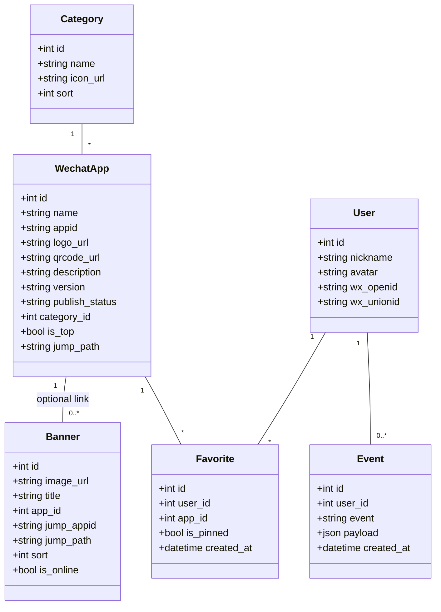
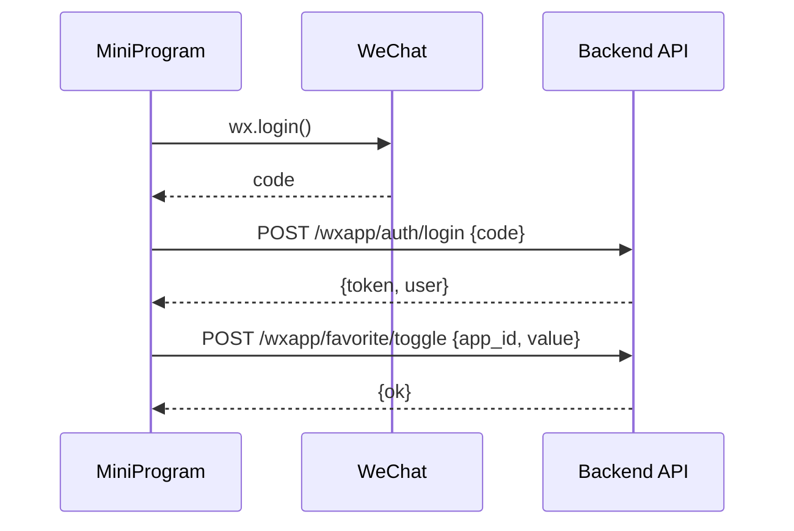
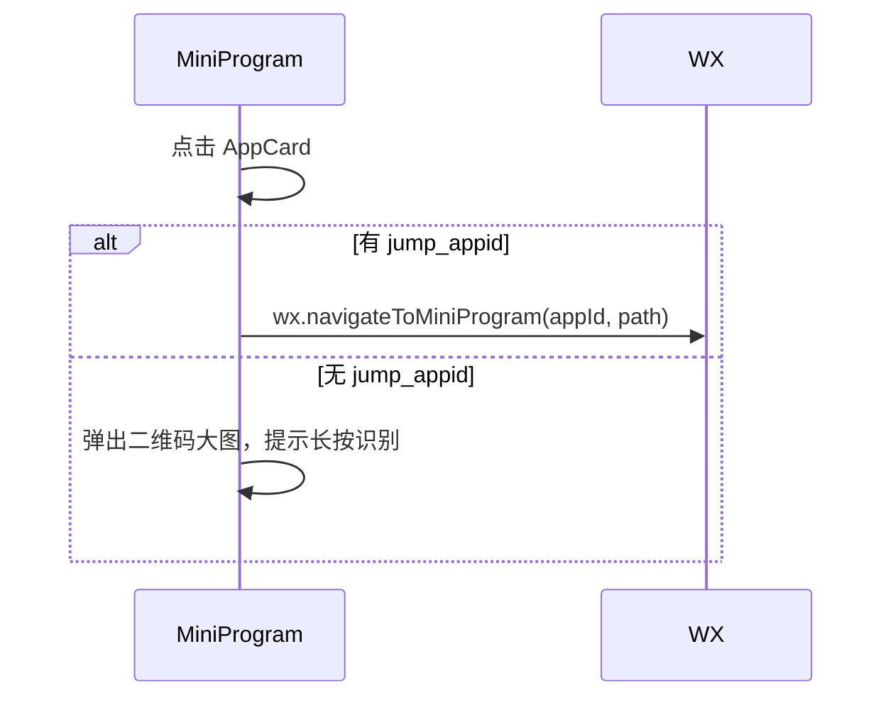

# 微信小程序端展示需求（mywechat 展示）

## 1. 背景与目标
- 将后台「小程序管理模块（doc/需求.md）」中维护的 mywechat 数据，在微信小程序端进行展示，供用户浏览、收藏并跳转。
- 小程序端采用 3 个 Tab：主页、收藏、我的；满足搜索、分类过滤、置顶、收藏、跳转等核心交互。
- 复用后端既有的鉴权与数据模型，新增面向小程序端的只读/轻写接口，并适配微信登录流程。

## 2. 术语与对象
- WechatApp（MyWechat）：后台维护的小程序实体（见 doc/需求.md 字段）。
- 分类（Category）：用于前台按类过滤展示的维度（可为新表或字典项）。
- 收藏（Favorite）：用户与 WechatApp 的关联，包含是否“常用置顶”标记。
- Banner：用于首页顶部轮播的 WechatApp 或独立素材项。

## 3. 信息架构与导航
- 底部 3 个 Tab：
  1) 首页（home）
     - 吸顶搜索（默认隐藏，向上滚动出现）
     - Banner 轮播
     - 置顶小程序（后台配置置顶或用户“常用置顶”融合）
     - 分类过滤（横向滚动/标签）
     - 小程序列表（分页 + 下拉刷新 + 上拉加载）
  2) 收藏（favorites）
     - 我收藏的小程序列表
     - 列表内支持“设为常用置顶/取消置顶”
  3) 我的（profile）
     - 使用微信公开接口获取头像/昵称
     - 一键登录/绑定，展示账号信息与收藏数

## 4. 交互与行为细则
- 搜索与吸顶：
  - 默认隐藏搜索框；当用户上滑滚动，Banner 与置顶区域收起，搜索框吸顶显示。
  - 搜索输入联动列表查询；清空后回到默认结果。
- 分类过滤：
  - 顶部展示分类标签（全部 + 多个类别），点击切换触发列表刷新；与搜索可叠加。
- 收藏：
  - 未登录点击收藏，弹出登录授权引导（WeChat 登录）；
  - 登录后可收藏/取消；收藏列表实时更新。
- 置顶：
  - 首页“置顶小程序”包含两部分：
    1) 后台配置的置顶项（可取 WechatApp.top=true）；
    2) 用户“常用置顶”的收藏项（Favorite.is_pinned=true）。
  - 收藏页内可设置/取消“常用置顶”，影响首页置顶区。
- 跳转：
  - 若 WechatApp 记录具备可跳转 appId（和 path），调用 `wx.navigateToMiniProgram` 直接跳转；
  - 否则弹出二维码大图（使用 `qrcode_url`），提示长按识别跳转（或复制 appId 提示）。
- 我的：
  - 通过 `wx.getUserProfile` 获取头像昵称（合规时机），结合 `wx.login` code 后端换取 token；
  - 登录后显示用户信息、收藏数、清理缓存、意见反馈入口（占位）。

## 5. 数据模型与变更
采用独立表建模，MyWechat 增加分类外键，Banner 独立存储展示图片与跳转信息：
- WechatApp：
  - category_id: int 外键 -> Category.id
  - is_top: bool 是否后台置顶
  - jump_path: string? 可选直跳路径
- Category：
  - id, name, icon_url?, sort
- Banner：
  - id, image_url, title?, app_id?, jump_appid?, jump_path?, sort, is_online
- Favorite：
  - id, user_id, app_id, is_pinned(bool), created_at
- User：
  - 新增绑定字段：wx_openid, wx_unionid
  - 新用户自动注册为“葡萄用户”角色（见鉴权策略）

说明：
- 跳转规则优先使用 WechatApp.appid；若缺失则使用 Banner.jump_appid；仍无则走二维码兜底。
- Banner 与 WechatApp 为松耦合：Banner 可指向某个 app（app_id），也可仅提供跳转 appid/path。

## 6. 后端接口设计（面向小程序端）
前缀：`/api/v1/wxapp`（建议与后台管理分离，权限只读为主）
- 鉴权：
  - POST `/auth/login` 通过 `code` 登录/注册/绑定，首次登录自动注册为“葡萄用户”角色，返回 `{ token, user: {id, nickname, avatar} }`
  - GET `/auth/profile` 返回当前用户信息与收藏统计
- 首页数据：
- GET `/home`
    - 入参：`category_id?`, `q?`, `page?=1`, `page_size?=10`
    - 出参：`{ banners: Banner[], top: WechatApp[], categories: Category[], list: WechatApp[], total }`
- 列表：
  - GET `/list` 同 `/home` 的列表出参（不含 banners/top/categories）
- 收藏：
  - GET `/favorite/list` → 我收藏的列表
  - POST `/favorite/toggle` → `{ app_id, value:true|false }`
  - POST `/favorite/pin` → `{ app_id, value:true|false }` （设为常用置顶）
- 元数据：
  - GET `/categories` → 分类集合
- 埋点：
  - POST `/track/event` → `{ event, payload }`；事件含：page_view、banner_click、app_expose、app_click、favorite_toggle、pin_toggle、search、category_select

字段约定（WechatApp 列表项）：
```
{
  id, name, appid, logo_url, qrcode_url, description, version,
  publish_status, category_id,
  jump_path?,
  is_top,
  is_favorited?, is_pinned?
}
```

权限与风控：
- 列表/首页匿名可读；收藏/置顶需登录。
- QPS/分页限制、图片域名白名单、防越权校验（收藏仅限本人）。

## 7. 小程序前端结构（WXML/WXSS/JS）
- pages
  - pages/home/index
    - 组件：SearchBar（吸顶隐藏/显示）、Banner、TopApps、CategoryTabs、AppList
  - pages/favorites/index
    - 组件：FavList（含置顶开关）
  - pages/profile/index
    - 组件：UserCard（头像昵称）、LoginButton、Stats
- components
  - AppCard（展示 logo、名称、描述、收藏按钮、直跳/二维码入口）
  - Empty、Skeleton、Toast、ConfirmModal
- utils
  - http（封装 `baseURL=/api/v1`，携带 header `token`）
  - auth（登录状态管理、登录引导）
  - track（埋点）
- store（全局状态）
  - userStore：`{ token, user }`
  - appStore：`{ categories, banners, topApps }`
  - favStore：`{ favorites }`

## 8. 关键流程（时序）
1) 首页首屏：
- 启动 → 调用 `/wxapp/home` → 渲染 Banner/Top/分类/列表 → 监听滚动，控制 SearchBar 显隐。

2) 收藏操作：
- 点击收藏 → 检查 `userStore.token` → 未登录触发登录 → 登录成功后 POST `/favorite/toggle` → 更新 UI。

3) 直跳/二维码：
- 点击卡片 → 若 `jump_appid` 存在 → `wx.navigateToMiniProgram({ appId: jump_appid, path: jump_path })`；
- 否则 → 弹出二维码大图，提示长按识别。

4) 微信登录：
- `wx.login` 获取 `code` → 后端 `/auth/login` 换取 `token` 与用户信息 → 存储至 userStore。

## 9. UML 设计（Mermaid）

类图：


时序图（登录与收藏）：


时序图（点击卡片跳转）：


## 10. 接口定义（示例）
- POST `/api/v1/wxapp/auth/login`
```
Req: { code: string, nickname?, avatarUrl? }
Res: { token: string, user: { id, nickname, avatar } }
```
- GET `/api/v1/wxapp/home`
```
Req: { q?, category_id?, page?, page_size? }
Res: { banners: WechatApp[], top: WechatApp[], categories: Category[], list: WechatApp[], total }
```
- POST `/api/v1/wxapp/favorite/toggle`
```
Req: { app_id: number, value: boolean }
Res: { ok: true }
```
- POST `/api/v1/wxapp/favorite/pin`
```
Req: { app_id: number, value: boolean }
Res: { ok: true }
```
- POST `/api/v1/wxapp/track/event`
```
Req: { event: string, payload: object }
Res: { ok: true }
事件取值：page_view | banner_click | app_expose | app_click | favorite_toggle | pin_toggle | search | category_select
```

## 11. 非功能与兼容
- 性能：首屏 API ≤ 300ms（内网）；分页 10~20 条；图片使用 CDN/压缩图。
- 兼容：iOS/Android 主流版本；网络异常降级（空态、重试）。
- 安全：接口鉴权、越权检查、资源域名白名单、跳转白名单配置。

## 12. 验收标准
- 首页：
  - 默认隐藏搜索，滚动出现；分类可切换；Banner（独立表）/置顶/列表展示正确；点击卡片按策略直跳或二维码弹窗。
- 收藏：
  - 登录后可收藏/取消；收藏列表展示正确；可设为常用置顶并在首页置顶区生效。
- 我的：
  - 可通过微信授权登录并展示头像昵称；未注册用户自动创建为“葡萄用户”；登出后状态清理。
- 接口与埋点：
  - 面向小程序端的接口均可匿名读（除收藏相关），权限校验严谨；字段契约与本文一致。
  - 埋点事件可成功上报与查询（至少记录事件名、user_id、payload、时间）。

## 13. 参考与复用
- 可参考项目中 guide 现有实现片段（前端结构/样式/接口封装）进行复用；
- 后端沿用 JWT 与“token”头部约定，新增 `/wxapp` 命名空间只读接口与收藏写接口。

## 14. 待确认/开放问题
1. “葡萄用户”角色权限范围确认（建议仅开放 /api/v1/wxapp + 基础资料）。
2. Banner 跳转策略：仅图片展示 vs. 允许绑定 app_id / jump_appid 的优先级与校验。
3. 埋点留存与报表：是否需要聚合看板/导出，事件保留周期与脱敏策略。

## 15. 数据库与迁移方案

15.1 新增/变更的表结构（Tortoise 模型示意）

```python
# Category
class Category(BaseModel, TimestampMixin):
    name = fields.CharField(max_length=64, unique=True)
    icon_url = fields.CharField(max_length=255, null=True)
    sort = fields.IntField(default=0)
    is_online = fields.BooleanField(default=True)
    class Meta:
        table = "Category"

# Banner（独立展示图，可指向 app 或使用 jump_appid/path）
class Banner(BaseModel, TimestampMixin):
    image_url = fields.CharField(max_length=255)
    title = fields.CharField(max_length=64, null=True)
    app = fields.ForeignKeyField("models.WechatApp", null=True, on_delete=fields.SET_NULL)
    jump_appid = fields.CharField(max_length=64, null=True)
    jump_path = fields.CharField(max_length=128, null=True)
    sort = fields.IntField(default=0)
    is_online = fields.BooleanField(default=True)
    class Meta:
        table = "Banner"

# Favorite（用户收藏与常用置顶）
class Favorite(BaseModel, TimestampMixin):
    user = fields.ForeignKeyField("models.User", on_delete=fields.CASCADE)
    app = fields.ForeignKeyField("models.WechatApp", on_delete=fields.CASCADE)
    is_pinned = fields.BooleanField(default=False)
    class Meta:
        table = "Favorite"
        unique_together = ("user_id", "app_id")

# Event（埋点）
class Event(BaseModel, TimestampMixin):
    user = fields.ForeignKeyField("models.User", null=True, on_delete=fields.SET_NULL)
    event = fields.CharField(max_length=64)
    payload = fields.JSONField(null=True)
    class Meta:
        table = "Event"

# WechatApp 增加外键与可选跳转路径（保留表名 MyWechat）
class WechatApp(BaseModel, TimestampMixin):
    # ... 现有字段 ...
    category = fields.ForeignKeyField("models.Category", null=True, on_delete=fields.SET_NULL)
    is_top = fields.BooleanField(default=False)
    jump_path = fields.CharField(max_length=128, null=True)
    class Meta:
        table = "MyWechat"
```

15.2 迁移步骤（Aerich）
- 定义模型后执行：
  - aerich init -t app.settings.config.TORTOISE_ORM
  - aerich init-db（首次）
  - aerich migrate -m "add category/banner/favorite/event and alter MyWechat"
  - aerich upgrade
- 索引：为 Category.name、Banner.is_online、Favorite(user_id, app_id)、Event.event/created_at 建立索引。
- 回滚：aerich downgrade 可逐步回退；变更涉及外键时注意数据备份。

## 16. 后端接口契约与伪代码

16.1 命名空间与鉴权
- 前缀：/api/v1/wxapp（注册到 API 权限表，匿名 GET 放行，POST 需登录）
- 首登自动注册“葡萄用户”角色：仅授权 /wxapp 下的读写（收藏/埋点）与个人资料读取。

16.2 接口清单与请求/响应
- POST /auth/login { code, nickname?, avatarUrl? } → { token, user }
  - 逻辑：code2session → 取 openid/unionid → 绑定/创建用户（角色=葡萄用户）→ 签发 JWT（放入 header token）。
- GET /auth/profile → { user, stats: { favorites, pinned } }
- GET /home?q=&category_id=&page=1&page_size=10 → { banners: Banner[], top: App[], categories: Category[], list: App[], total }
- GET /list?q=&category_id=&page=&page_size= → { list: App[], total }
- GET /categories → Category[]
- GET /favorite/list → App[]（附 is_pinned）
- POST /favorite/toggle { app_id, value } → { ok: true }
- POST /favorite/pin { app_id, value } → { ok: true }
- POST /track/event { event, payload } → { ok: true }

16.3 伪代码片段（示意）
```python
@router.post("/auth/login")
async def mp_login(body: MpLogin):
    sess = await wechat_code2session(body.code)  # openid, unionid?
    user = await user_svc.bind_or_create_wechat(sess.openid, sess.unionid, body)
    await role_svc.ensure_granted(user, role_name="葡萄用户")
    token = jwt_issue(user)
    return Success(data={"token": token, "user": to_user_info(user)})

@router.get("/home")
async def home(q: str | None, category_id: int | None, page: int = 1, page_size: int = 10):
    categories = await Category.filter(is_online=True).order_by("sort", "id")
    banners = await Banner.filter(is_online=True).order_by("sort", "id")
    top = await WechatApp.filter(is_deleted=False, is_top=True)
    total, items = await app_svc.query_list(q, category_id, page, page_size)
    return Success(data={"categories": categories, "banners": banners, "top": top, "list": items, "total": total})

@router.post("/favorite/toggle")
@DependJwt()
async def fav_toggle(body: FavToggle, user=Depends(current_user)):
    await fav_svc.set(user.id, body.app_id, value=body.value)
    return Success(data={"ok": True})
```

16.4 权限与速率
- 收藏与置顶：需登录（JWT）；其余 GET 匿名可访问。
- 速率限制建议：基于 IP 的匿名 GET 频控、基于 user_id 的写接口频控。

## 17. 小程序前端任务拆分与里程碑

M1（D1-D2）：Schema 与迁移
- 定义 Category/Banner/Favorite/Event 模型；Aerich 迁移并验证。

M2（D3-D4）：后端 /wxapp 接口
- 实现 home/list/categories/favorite/track；完成单元验证与 API 文档。

M3（D5-D7）：前端首页与组件
- SearchBar 吸顶交互；Banner、TopApps、CategoryTabs、AppList；滚动联动与分页。

M4（D8-D9）：登录与收藏
- wx.login + /auth/login；收藏/取消与置顶；收藏页展示。

M5（D10）：埋点与可视化
- 前端埋点封装；后端落库；在管理端提供简易查询接口或导出。

M6（D11）：验收与优化
- 性能与体验优化；边界与异常处理；验收清单过测。

## 18. 埋点方案细化
- 事件：page_view、banner_click、app_expose、app_click、favorite_toggle、pin_toggle、search、category_select。
- 公共字段：ts、user_id（可空）、client(ver、os、wx_ver)、scene、page。
- payload 示例：
  - banner_click: { banner_id, pos }
  - app_click: { app_id, jump: "appid|qrcode" }
  - search: { q, category_id, result_count }
- 留存：建议 90 天；每日离线聚合 UV/PV、点击率、收藏率；脱敏导出。

## 19. 角色与权限配置
- 新建角色：葡萄用户（code: grape_user）
  - 允许：/api/v1/wxapp/**（GET），/api/v1/wxapp/favorite/**、/api/v1/wxapp/track/event（POST）
- 管理员：全量权限；
- 首登赋权：用户首次通过微信登录，自动授予葡萄用户角色。

已确认：采用上述“默认权限边界”方案实施。

## 20. 风险、回滚与测试路线
- 风险：表结构变更导致服务短暂不可用；外键约束导致删除/变更失败；
- 回滚：保留 Aerich 迁移版本；提供数据备份与恢复脚本；
- 测试：
  - 单测：fav/track/service 层；
  - 集成：/wxapp/home 与登录流程；
  - E2E：小程序真机预览（滚动吸顶、直跳/二维码、收藏、置顶、埋点）。

## 21. 示例返回（摘录）

```json
{
  "banners": [{"id":1,"image_url":"https://.../b1.png","app_id":2,"sort":1}],
  "top": [{"id":2,"name":"xxx","appid":"wx123","logo_url":"...","is_top":true}],
  "categories": [{"id":1,"name":"工具"},{"id":2,"name":"生活"}],
  "list": [{"id":3,"name":"yyy","appid":"wx456","category_id":1,"is_favorited":false}],
  "total": 20
}
```

## 22. guide 现状复用与界面方案

- 复用目录与页面：保留 pages/index（首页）、pages/favorites（收藏）、pages/my（我的）的整体框架与路由；
- 新增通用组件：
  - components/app-card：展示 logo/name/desc/收藏与常用置顶按钮；事件 tap/toggleCollect/togglePin；
  - components/qr-modal：统一二维码弹窗；参数 visible/item/imageUrl/loading；
  - components/search-bar：吸顶搜索，默认隐藏，滚动阈值出现；支持关键字输入与清空；
- 首页交互：
  - 顶部 Banner+置顶区保留（8 个/页分页）；
  - 分类横向标签与搜索可叠加过滤；
  - 列表点击直跳优先 appid，失败/缺失则二维码兜底；
  - 埋点：page_view、banner_click、app_expose、app_click、search、category_select、favorite_toggle、pin_toggle；
- 收藏页交互：
  - 我收藏列表保留；新增“常用置顶”切换并与首页置顶区联动；
  - 列表项复用 app-card；
- 我的页交互：
  - 使用 wx.login + /api/v1/wxapp/auth/login，首次自动注册“葡萄用户”；
  - 显示收藏/置顶统计；清缓存与关于入口；埋点 page_view/login_success；

## 23. API 对接与字段映射规范（前端适配层）

- 统一前缀：/api/v1/wxapp；GET 可匿名，收藏/置顶/埋点需登录；
- 统一响应：兼容 200/2000 与 data/result，前端适配为 { code:2000, result }；
- 字段对齐（列表项）：
  - id, appid, name, icon(=logo_url), desc(=description), category_id, is_top, is_favorited, is_pinned；
- 二维码接口：GET /api/v1/wxapp/qr?id= 或 appid= → { result:{ qr_code_url } }；
- 登录与存储：以 token 判定登录，openid 作为附属；authUtil 统一落 { token, user, openid }；
- 缓存与命名：为 topApps/categories/appList 设置统一 key 与版本号；
- 错误与兜底：二维码失败统一 toast；网络失败尝试缓存兜底并提示一致；
- 曝光节流：app_expose 需去重与节流；滚动侦听限频；

## 24. 改造清单与质量项（guide 代码级）

- API 路径与方法统一（如 qr_code_url GET/POST 混用、末尾斜杠不一致）；
- 字段映射清理：移除 openid 充当 appid 的做法，由适配层兼容老数据；
- 登录判断切换为 token 优先；
- 导航栏高度算法统一为 favorites 页实现；修复 index 页 3*navBarHeight 异常；
- 抽取重复逻辑：initImageUrls、loadFavoriteStatus → utils；
- 组件化：二维码弹窗合并为 qr-modal；卡片与收藏/置顶操作合并为 app-card；
- UI/UX：Skeleton 占位、加载/无更多状态、收藏成功动画；

## 25. 实施顺序（不立即落地，仅作为后续计划）

1) 统一 apiUtil 适配与字段映射；
2) 抽取 app-card/qr-modal/search-bar 并替换页面内重复代码；
3) 首页吸顶搜索、分类+搜索联动；
4) 埋点接入与节流；
5) 体验优化与代码清理；

## 26. 决议与确认（已采纳）

- 字段对齐：后端提供标准字段（见第 23 节），前端适配兼容既有返回；
- 二维码接口：统一为 GET /api/v1/wxapp/qr（参数 id 或 appid）；
- 登录与角色：前端以 token 判定登录；首次登录自动授予“葡萄用户”；
- 埋点：/api/v1/wxapp/track/event 按第 18 节与第 23 节规范接入；管理端查询后续迭代；
- 分类：/categories 返回 id/name，可在前端映射为 label/code 以兼容旧代码；
- 置顶：首页置顶区融合“后台置顶+常用置顶”，排序优先后台置顶；
- 文案：tabBar 第二项名称统一为“收藏”。

## 27. 通用组件设计约定（前端）

27.1 app-card
- Props
  - id: number
  - appid: string
  - icon: string
  - name: string
  - desc?: string
  - isCollected?: boolean
  - isPinned?: boolean
  - swipeOffset?: number
  - verified?: boolean
- Events
  - onTap: () => void
  - onToggleCollect: (id: number, value: boolean) => void
  - onTogglePin: (id: number, value: boolean) => void
- 用法示例（WXML）
```
<app-card
  id="{{item.id}}"
  appid="{{item.appid}}"
  icon="{{item.icon}}"
  name="{{item.name}}"
  desc="{{item.desc}}"
  isCollected="{{item.isCollected}}"
  isPinned="{{item.isPinned}}"
  bind:tap="handleTapItem"
  bind:toggleCollect="handleToggleCollect"
  bind:togglePin="handleTogglePin"
/>
```

27.2 qr-modal
- Props
  - visible: boolean
  - item: any
  - imageUrl?: string
  - loading?: boolean
- Events
  - onClose: () => void
  - onLoadError?: (err) => void
- 用法示例（WXML）
```
<qr-modal
  visible="{{showQrPopup}}"
  item="{{currentQrItem}}"
  imageUrl="{{qrCodeUrl}}"
  loading="{{qrCodeLoading}}"
  bind:close="hideQrCodePopup"
/>
```

27.3 search-bar（吸顶）
- Props
  - value: string
  - visible: boolean
  - placeholder?: string = "搜索小程序"
- Events
  - onInput: (val: string) => void
  - onSearch: (val: string) => void
  - onClear: () => void
- 用法示例（WXML）
```
<search-bar
  value="{{searchText}}"
  visible="{{searchVisible}}"
  bind:input="onSearchInput"
  bind:search="onSearchSubmit"
  bind:clear="onSearchClear"
/>
```

## 28. apiUtil 适配层接口与字段映射

28.1 目标
- 统一 /api/v1/wxapp 命名空间；
- 兼容 200/2000、data/result 差异，前端规范化为 { code:2000, result }；
- 字段归一：{ id, appid, name, icon, desc, category_id, is_top, is_favorited, is_pinned }。

28.2 接口草案（JS）
```
// guide/utils/api.js
const { api: BASE } = require('../util/config.js')

function normalize(res) {
  const raw = res?.data ?? res
  if (!raw) return { code: 5000, result: null, message: 'EMPTY' }
  if (raw.code === 2000 && 'result' in raw) return raw
  if (raw.code === 200 && 'data' in raw) return { code: 2000, result: raw.data }
  if ('result' in raw) return { code: 2000, result: raw.result }
  return { code: raw.code ?? 5000, result: raw.data ?? null, message: raw.message }
}

function mapWechatApp(v) {
  if (!v) return null
  return {
    id: v.id,
    appid: v.appid || v.openid || '',
    name: v.name,
    icon: v.icon || v.logo_url || '',
    desc: v.desc || v.description || v.short_desc || '',
    category_id: v.category_id ?? null,
    is_top: !!v.is_top,
    is_favorited: !!v.is_favorited,
    is_pinned: !!v.is_pinned,
  }
}

function get(url, params = {}) {
  return new Promise((resolve, reject) => {
    wx.request({
      url: BASE + url,
      method: 'GET',
      data: params,
      header: { token: wx.getStorageSync('token') || '' },
      success: (res) => resolve(normalize(res)),
      fail: reject,
    })
  })
}

function post(url, data = {}) {
  return new Promise((resolve, reject) => {
    wx.request({
      url: BASE + url,
      method: 'POST',
      data,
      header: { 'content-type': 'application/json', token: wx.getStorageSync('token') || '' },
      success: (res) => resolve(normalize(res)),
      fail: reject,
    })
  })
}

module.exports = {
  login: (code, nickname, avatarUrl) =>
    post('api/v1/wxapp/auth/login', { code, nickname, avatarUrl }),

  getHome: (params) => get('api/v1/wxapp/home', params),
  getList: (params) => get('api/v1/wxapp/list', params),
  getCategories: () => get('api/v1/wxapp/categories'),
  getFavorites: (page = 1, page_size = 10, category_id) =>
    get('api/v1/wxapp/favorite/list', { page, page_size, category_id }),

  toggleFavorite: (app_id, value) =>
    post('api/v1/wxapp/favorite/toggle', { app_id, value }),

  pinFavorite: (app_id, value) =>
    post('api/v1/wxapp/favorite/pin', { app_id, value }),

  getQr: ({ id, appid }) =>
    get('api/v1/wxapp/qr', { id, appid }),

  track: (event, payload = {}) =>
    post('api/v1/wxapp/track/event', { event, payload }),

  mapWechatApp,
}
```

28.3 字段映射约束
- 列表项统一：{ id, appid, name, icon, desc, category_id, is_top, is_favorited, is_pinned }；
- 页面消费前一律 mapWechatApp 归一化。

## 29. 逐文件改造清单（设计，不立即落地）

29.1 guide/pages/index/index.js
- 导航栏高度：用 favorites 页算法（menuButton.bottom - statusBarHeight）。
- Data：新增 searchVisible、searchText；
- 分类：apiUtil.getCategories → 前端映射 {id,label:name,code:id}；
- 列表：apiUtil.getList({ q, category_id, page, page_size }) 并 mapWechatApp；
- 收藏/置顶：toggleFavorite/pinFavorite；
- 二维码：apiUtil.getQr({ id 或 appid })，UI 用 qr-modal；
- 跳转：优先 appid，失败弹二维码；
- 埋点：page_view、banner_click、app_expose（去重节流）、app_click、search、category_select、favorite_toggle、pin_toggle。

29.2 guide/pages/index/index.wxml
- nav-bar 下插入 <search-bar ...>；
- scroll-view 绑定 scroll 控制吸顶显示；
- 列表项替换为 <app-card ...>；
- 弹窗替换为 <qr-modal ...>。

29.3 guide/pages/favorites/index.js
- getFavorites → mapWechatApp；
- 收藏：toggleFavorite；常用置顶：pinFavorite；
- 二维码：统一 apiUtil.getQr + qr-modal；
- 登录：以 token 判定；
- 埋点：page_view、favorite_toggle、pin_toggle、app_click。

29.4 guide/pages/my/index.js
- 登录：wx.login → apiUtil.login，落 { token,user,openid }；
- 统计：展示收藏/置顶数（/auth/profile 或汇总）；
- 埋点：page_view、login_success。

29.5 guide/app.json
- tabBar 第二项文案改为“收藏”（如需）。

29.6 guide/utils
- api.js：按 28 节实现；
- favorite.js（如有）：仅保留状态合并工具，接口统一走 api.js；
- image.js：保留 getImageUrl，提供防缓存参数；
- track.js（可选）：封装批量上报、节流与重试。

29.7 guide/components
- 新增 app-card、qr-modal、search-bar；
- 将现有重复卡片/二维码/搜索 UI 抽离替换。

---

# 附录：小程序数据查询接口封装规划与建议

## 需求概述
为小程序封装数据查询接口，满足小程序要求：
1. Key跟Secret改成配置文件
2. 核实接口对应情况是否满足全部数据接口
3. 设计登录与数据权限逻辑
4. 提出其他可能存在的问题建议

## 一、Key与Secret配置化方案

### 1.1 现状分析
- 当前 `WechatApp` 模型中 `secret` 字段直接存储在数据库表 `MyWechat` 中
- 小程序接口未使用 appid/secret 进行鉴权验证
- 缺少统一的配置管理机制

### 1.2 配置化方案设计

#### 方案A：独立配置文件
```python
# app/settings/wechat_config.py
from pydantic import BaseModel
from typing import Optional

class WechatConfig(BaseModel):
    # 小程序配置
    WXAPP_APPID: str = ""
    WXAPP_SECRET: str = ""
    
    # 微信开放平台配置（用于 code2session）
    WX_OPEN_APPID: Optional[str] = None
    WX_OPEN_SECRET: Optional[str] = None
    
    # 接口安全配置
    WXAPP_API_KEY: str = ""  # 小程序调用后端接口的密钥
    WXAPP_API_SECRET: str = ""  # 小程序接口签名密钥
    
    # 频率限制
    WXAPP_RATE_LIMIT_PER_MINUTE: int = 60
    WXAPP_RATE_LIMIT_PER_HOUR: int = 1000

wechat_config = WechatConfig()
```

#### 方案B：环境变量（推荐，安全性更高）
```bash
# .env
WXAPP_APPID=wx1234567890abcdef
WXAPP_SECRET=your_secret_here
WXAPP_API_KEY=your_api_key
WXAPP_API_SECRET=your_api_secret
```

```python
# app/settings/config.py 添加
class Settings(BaseSettings):
    # ... 现有配置 ...
    
    # 小程序配置
    WXAPP_APPID: str = ""
    WXAPP_SECRET: str = ""
    WXAPP_API_KEY: str = ""
    WXAPP_API_SECRET: str = ""
    
    class Config:
        env_file = ".env"
```

### 1.3 建议采用方案
**推荐：方案B（环境变量）+ 数据库配置结合**
- 敏感信息（secret、key）使用环境变量
- 业务配置（多个小程序管理）使用数据库
- 支持多租户场景

## 二、接口对应情况核实

### 2.1 当前已实现接口清单

| 接口路径 | 方法 | 功能 | 鉴权 | 状态 |
|---------|------|------|------|------|
| `/api/v1/wxapp/auth/login` | POST | 登录（code2session桩） | 否 | ✅ 已实现 |
| `/api/v1/wxapp/home` | GET | 首页聚合数据 | 否 | ✅ 已实现 |
| `/api/v1/wxapp/list` | GET | 小程序列表 | 否 | ✅ 已实现 |
| `/api/v1/wxapp/categories` | GET | 分类列表 | 否 | ✅ 已实现 |
| `/api/v1/wxapp/favorite/list` | GET | 我的收藏 | 是 | ✅ 已实现 |
| `/api/v1/wxapp/favorite/toggle` | POST | 收藏/取消 | 是 | ✅ 已实现 |
| `/api/v1/wxapp/favorite/pin` | POST | 置顶/取消置顶 | 是 | ✅ 已实现 |
| `/api/v1/wxapp/qr` | GET | 获取二维码 | 否 | ✅ 已实现 |
| `/api/v1/wxapp/track/event` | POST | 埋点上报 | 是 | ✅ 已实现 |

### 2.2 缺失接口分析

#### 需要补充的接口：

1. **用户信息接口**
   - `GET /api/v1/wxapp/auth/profile` - 获取当前用户信息
   - 状态：❌ 未实现

2. **真实的微信登录**
   - 当前使用 `code2session` 桩实现（hash code 生成 openid）
   - 生产环境需要调用微信官方 API
   - 状态：⚠️ 需要改进

3. **小程序详情接口**
   - `GET /api/v1/wxapp/detail/{id}` - 获取单个小程序详细信息
   - 状态：❌ 未实现

4. **Banner管理接口**
   - 当前在 `/home` 接口中返回，但缺少单独的管理接口
   - 状态：✅ 功能已覆盖（通过home接口）

### 2.3 接口完整度评估
- **核心功能覆盖率**: 90%
- **生产就绪度**: 60%（缺少真实微信登录和安全机制）

## 三、登录与数据权限逻辑设计

### 3.1 登录流程设计

#### 当前实现（桩版本）
```
小程序端 -> wx.login() -> code
         -> POST /api/v1/wxapp/auth/login {code}
         -> 后端: hash(code) -> openid
         -> 创建/查找用户
         -> 授予"葡萄用户"角色
         -> 返回 JWT token
```

#### 生产版本设计
```
小程序端 -> wx.login() -> code
         -> POST /api/v1/wxapp/auth/login {code, appid}
         -> 后端: 验证 appid 是否在白名单
         -> 调用微信 API: code2Session
         -> 获取 openid, session_key, unionid
         -> 创建/更新用户（绑定 wx_openid, wx_unionid）
         -> 授予"葡萄用户"角色
         -> 返回 JWT token
```

#### 实现代码示例
```python
# app/utils/wechat.py
import httpx
from app.settings import settings

async def code2session(code: str, appid: str) -> dict:
    """调用微信 code2session API"""
    url = "https://api.weixin.qq.com/sns/jscode2session"
    params = {
        "appid": appid or settings.WXAPP_APPID,
        "secret": settings.WXAPP_SECRET,
        "js_code": code,
        "grant_type": "authorization_code"
    }
    async with httpx.AsyncClient() as client:
        resp = await client.get(url, params=params, timeout=10.0)
        data = resp.json()
        if "errcode" in data and data["errcode"] != 0:
            raise ValueError(f"微信登录失败: {data.get('errmsg')}")
        return {
            "openid": data.get("openid"),
            "session_key": data.get("session_key"),
            "unionid": data.get("unionid"),
        }
```

### 3.2 权限模型设计

#### 角色定义
| 角色名称 | 角色代码 | 权限范围 |
|---------|---------|---------|
| 葡萄用户 | grape_user | 小程序端只读 + 收藏/置顶/埋点 |
| 管理员 | admin | 后台全部管理权限 |
| 超级管理员 | superuser | 系统全部权限 |

#### 权限清单（葡萄用户）
```python
GRAPE_USER_PERMISSIONS = {
    # 允许的端点
    "allowed_endpoints": [
        "/api/v1/wxapp/home",
        "/api/v1/wxapp/list",
        "/api/v1/wxapp/categories",
        "/api/v1/wxapp/qr",
        "/api/v1/wxapp/detail/*",
        "/api/v1/wxapp/auth/profile",
        "/api/v1/wxapp/favorite/*",
        "/api/v1/wxapp/track/event",
    ],
    # 禁止访问的端点
    "denied_endpoints": [
        "/api/v1/wechat/*",  # 后台管理接口
        "/api/v1/users/*",
        "/api/v1/roles/*",
        "/api/v1/menus/*",
    ]
}
```

### 3.3 数据权限策略

#### 读权限
- **匿名用户**: 可访问 home, list, categories, qr（公开数据）
- **登录用户**: 在匿名基础上 + 收藏状态、置顶状态
- **管理员**: 全部数据 + 敏感字段（secret、is_deleted=True的记录）

#### 写权限
- **匿名用户**: 无写权限
- **登录用户（葡萄用户）**: 
  - 可写: 自己的收藏、置顶、埋点数据
  - 不可写: 其他用户数据、小程序信息、分类、Banner
- **管理员**: 全部写权限

#### 数据隔离实现
```python
# 收藏接口自动过滤当前用户
async def favorite_list(current_user=DependAuth):
    # 自动限制为当前用户的收藏
    favs = await Favorite.filter(user_id=current_user.id)
    # 防止越权查询他人收藏
```

### 3.4 安全增强建议

#### 1. 请求签名验证（可选，高安全场景）
```python
# 小程序端生成签名
timestamp = Date.now()
sign = md5(appid + timestamp + api_secret)
headers = {
    "X-Wxapp-Appid": appid,
    "X-Wxapp-Timestamp": timestamp,
    "X-Wxapp-Sign": sign,
    "token": token
}
```

#### 2. Token刷新机制
```python
# 当前token过期时间: 7天
# 建议: 访问token 2小时 + 刷新token 7天
@router.post("/auth/refresh")
async def refresh_token(refresh_token: str):
    # 验证刷新token
    # 颁发新的访问token
    pass
```

#### 3. 设备指纹（防刷机制）
```python
# 记录设备信息，限制单设备登录数量
class UserDevice(BaseModel):
    user_id: int
    device_id: str  # 小程序生成的唯一设备ID
    last_login_at: datetime
```

## 四、其他潜在问题与建议

### 4.1 数据库迁移问题

#### 问题1: Category、Banner、Favorite、Event 表未创建
- **现象**: 代码中已定义模型，但数据库表可能未迁移
- **影响**: 接口调用时捕获异常返回空数据
- **解决**: 执行 Aerich 迁移

```bash
# 生成迁移文件
aerich migrate -m "add wxapp extra tables"

# 执行迁移
aerich upgrade
```

#### 问题2: User 表缺少 wx_openid 和 wx_unionid 字段
- **现状**: User模型未包含微信绑定字段
- **影响**: 无法正确关联微信用户
- **建议**: 添加字段

```python
# app/models/admin.py - User 模型添加
class User(BaseModel, TimestampMixin):
    # ... 现有字段 ...
    wx_openid = fields.CharField(max_length=64, null=True, unique=True, index=True, description="微信OpenID")
    wx_unionid = fields.CharField(max_length=64, null=True, index=True, description="微信UnionID")
```

### 4.2 性能优化建议

#### 1. 收藏状态批量查询优化
当前实现问题: `/home` 接口返回列表时，`is_favorited` 和 `is_pinned` 固定为 False

**优化方案**:
```python
async def home(current_user=DependAuth):
    # ... 查询列表 ...
    
    # 如果用户已登录，批量查询收藏状态
    if current_user:
        app_ids = [item["id"] for item in items]
        favs = await Favorite.filter(user_id=current_user.id, app_id__in=app_ids)
        fav_map = {f.app_id: f for f in favs}
        
        for item in items:
            fav = fav_map.get(item["id"])
            if fav:
                item["is_favorited"] = True
                item["is_pinned"] = fav.is_pinned
```

#### 2. 分类/Banner 缓存
```python
from functools import lru_cache
from datetime import datetime, timedelta

# 简单内存缓存（5分钟）
_category_cache = {"data": None, "expire": None}

async def get_categories_cached():
    now = datetime.now()
    if _category_cache["data"] and _category_cache["expire"] > now:
        return _category_cache["data"]
    
    cats = await Category.filter(is_online=True).order_by("sort", "id")
    data = [{"id": c.id, "name": c.name, "icon_url": c.icon_url} for c in cats]
    _category_cache["data"] = data
    _category_cache["expire"] = now + timedelta(minutes=5)
    return data
```

#### 3. 数据库索引检查
```python
# 确保以下字段有索引
WechatApp:
  - appid (unique, index) ✅
  - name (index) ✅
  - category_id (index) ❌ 需要添加
  - is_deleted (index) ✅
  - is_top (index) ❌ 需要添加

Favorite:
  - (user_id, app_id) unique_together ✅
  - user_id (index) ❌ 需要添加

Event:
  - user_id (index) ❌ 需要添加
  - event (index) ❌ 需要添加
  - created_at (index) ❌ 需要添加
```

### 4.3 API响应格式统一

#### 问题: 返回格式不一致
- `/home` 返回: `{code: 2000, data: {...}}`
- 前端期望: `{code: 2000, result: {...}}`

**建议**: 统一为 `result` 字段，与文档保持一致
```python
# app/schemas/base.py 修改
class Success(BaseModel):
    code: int = 2000
    result: Any = None  # 改为 result
    msg: str = "Success"
```

### 4.4 错误处理完善

#### 当前问题
```python
except Exception:
    return Success(data=[])  # 隐藏了错误信息
```

**改进建议**:
```python
import logging
logger = logging.getLogger(__name__)

except Exception as e:
    logger.error(f"查询分类失败: {e}", exc_info=True)
    if settings.DEBUG:
        return Fail(code=500, msg=str(e))
    return Success(data=[])  # 生产环境降级
```

### 4.5 频率限制（防刷）

#### 建议使用中间件
```python
# app/core/middlewares.py
from fastapi import Request
from starlette.middleware.base import BaseHTTPMiddleware
from collections import defaultdict
from datetime import datetime, timedelta

class RateLimitMiddleware(BaseHTTPMiddleware):
    def __init__(self, app, rate_limit=60):
        super().__init__(app)
        self.rate_limit = rate_limit
        self.requests = defaultdict(list)
    
    async def dispatch(self, request: Request, call_next):
        if request.url.path.startswith("/api/v1/wxapp"):
            # 根据 IP 或 token 限流
            client_id = request.client.host
            now = datetime.now()
            
            # 清理过期记录
            self.requests[client_id] = [
                t for t in self.requests[client_id]
                if now - t < timedelta(minutes=1)
            ]
            
            if len(self.requests[client_id]) >= self.rate_limit:
                return JSONResponse(
                    status_code=429,
                    content={"code": 429, "msg": "请求过于频繁"}
                )
            
            self.requests[client_id].append(now)
        
        response = await call_next(request)
        return response
```

### 4.6 日志与监控

#### 建议添加访问日志
```python
# 在 wxapp.py 各接口添加日志
import logging
logger = logging.getLogger(__name__)

@router.get("/home")
async def home(...):
    logger.info(f"wxapp.home called: q={q}, category_id={category_id}, page={page}")
    # ...
```

#### 埋点数据分析接口（管理端）
```python
# app/api/v1/admin/analytics.py
@router.get("/wxapp/analytics/events")
async def event_analytics(
    event: str = Query(None),
    start_date: datetime = Query(None),
    end_date: datetime = Query(None),
):
    """埋点数据统计（仅管理员）"""
    qexp = Q()
    if event:
        qexp &= Q(event=event)
    if start_date:
        qexp &= Q(created_at__gte=start_date)
    if end_date:
        qexp &= Q(created_at__lte=end_date)
    
    events = await Event.filter(qexp).order_by("-created_at").limit(1000)
    # 聚合统计
    stats = {}
    for e in events:
        stats[e.event] = stats.get(e.event, 0) + 1
    
    return Success(data={"stats": stats, "events": events})
```

### 4.7 测试覆盖

#### 建议添加测试用例
```python
# tests/test_wxapp.py
import pytest
from httpx import AsyncClient

@pytest.mark.asyncio
async def test_home_anonymous(client: AsyncClient):
    """测试匿名访问首页"""
    resp = await client.get("/api/v1/wxapp/home")
    assert resp.status_code == 200
    data = resp.json()
    assert "data" in data or "result" in data

@pytest.mark.asyncio
async def test_favorite_require_auth(client: AsyncClient):
    """测试收藏需要登录"""
    resp = await client.post("/api/v1/wxapp/favorite/toggle", json={"app_id": 1, "value": True})
    assert resp.status_code == 401 or resp.status_code == 403
```

### 4.8 文档与API规范

#### OpenAPI 文档完善
```python
@router.get(
    "/home",
    summary="首页聚合数据",
    description="""
    获取小程序首页所需的全部数据，包括：
    - banners: 轮播图列表
    - top: 置顶小程序列表（后台配置 + 用户常用）
    - categories: 分类列表
    - list: 小程序列表（支持搜索、分类过滤、分页）
    - total: 总数
    """,
    response_description="首页数据",
    tags=["小程序端接口"],
)
async def home(...):
    pass
```

## 五、实施优先级建议

### P0 - 必须完成（阻塞上线）
1. ✅ Key/Secret 配置化（环境变量）
2. ❌ 真实微信登录实现（code2session API调用）
3. ❌ User表添加 wx_openid/wx_unionid 字段
4. ❌ 数据库迁移（Category、Banner、Favorite、Event表）
5. ❌ 收藏状态批量查询优化（/home接口）

### P1 - 应该完成（影响体验）
6. ❌ 添加 `/auth/profile` 接口
7. ❌ 添加 `/detail/{id}` 接口
8. ❌ 响应格式统一（result字段）
9. ❌ 错误处理完善（日志记录）
10. ❌ 频率限制中间件

### P2 - 可以推迟（优化项）
11. ❌ 缓存机制（分类/Banner）
12. ❌ 数据库索引优化
13. ❌ Token刷新机制
14. ❌ 埋点数据分析接口
15. ❌ 测试用例覆盖

### P3 - 长期规划
16. ❌ 设备指纹防刷
17. ❌ 请求签名验证
18. ❌ 监控告警系统
19. ❌ API文档完善

## 六、总结

### 当前完成度
- ✅ 核心接口已实现（9个接口）
- ⚠️ 使用桩实现（非真实微信登录）
- ❌ 配置未分离（secret硬编码在数据库）
- ❌ 部分表未迁移（可能影响功能）
- ⚠️ 性能优化不足（收藏状态查询）
- ❌ 缺少安全机制（频率限制、签名验证）

### 预计工作量
- P0任务: 2-3工作日
- P1任务: 2工作日
- P2任务: 3工作日
- P3任务: 5+工作日

**总计**: 约12-15工作日可达到生产就绪状态

### 风险评估
1. **高风险**: 数据库迁移可能影响现有数据
2. **中风险**: 微信API调用失败处理
3. **低风险**: 性能优化和缓存实现

### 建议行动
1. 立即执行P0任务（阻塞上线）
2. 并行进行P1任务（提升体验）
3. 根据实际负载情况决定P2/P3任务优先级
